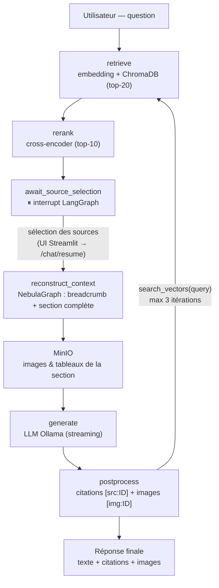

# RAG Agent Chat 💬

Ce projet est l'agent conversationnel qui consomme les données produites par [rag-ingestion-pipeline](https://github.com/floSa/rag-ingestion-pipeline). Il interroge **ChromaDB** (recherche vectorielle), reconstruit le contexte structurel des documents via **NebulaGraph**, récupère les médias depuis **MinIO**, et génère les réponses avec un LLM local servi par **Ollama** — le tout orchestré par une machine à états **LangGraph** avec sélection des sources par l'utilisateur (*human-in-the-loop*).

> Contrairement au RAG classique qui injecte des chunks isolés, l'agent utilise le **graphe de connaissances pour reconstruire la section complète** autour de chaque chunk trouvé : hiérarchie de titres (breadcrumb), paragraphes voisins, images et tableaux.

---

## 🛠 Architecture & Technologies

- **Agent (LangGraph)** : machine à états `retrieve → rerank → sélection user → reconstruction graphe → génération → post-processing`, avec boucle agentique (le LLM peut relancer une recherche via `search_vectors(query)`, max 3 itérations).
- **Backend (FastAPI)** : expose le flux complet (`/chat/start` + `/chat/resume`) et des endpoints unitaires (`/search`, `/sources`, `/context/{id}`, `/chat/simple`), avec réponses en streaming SSE.
- **Frontend (Streamlit)** : UI de chat en 3 phases — question, sélection des sources (cases à cocher groupées par document), réponse avec citations et images.
- **Retrieval** : embeddings `all-MiniLM-L6-v2` (le **même modèle** que l'ingestion, obligatoire) + reranking par cross-encoder `ms-marco-MiniLM-L6-v2` (local, sans appel API).
- **LLM local** : [Ollama](https://ollama.com/) (Gemma par défaut), téléchargé automatiquement au premier démarrage dans un volume persistant.
- **Stores en lecture** : ChromaDB, NebulaGraph et MinIO du projet d'ingestion, joints via le réseau Docker externe `rag_network`.

### Schéma du flux agent



L'étape clé est la **Graph Context Reconstruction** : pour chaque chunk sélectionné, l'agent remonte les arêtes `PARENT_OF` jusqu'au `SectionHeader` parent, puis redescend pour récupérer tous les enfants de la section dans l'ordre — le LLM reçoit ainsi une section complète et son breadcrumb au lieu d'un fragment de 500 caractères.

---

## 🚀 Quickstart

### 0. Prérequis

La stack [rag-ingestion-pipeline](https://github.com/floSa/rag-ingestion-pipeline) doit être **démarrée** (elle crée le réseau `rag_network` et héberge ChromaDB, NebulaGraph et MinIO) et avoir ingéré au moins un document.

### 1. Configurer l'environnement
```bash
# Copier le gabarit et remplir les valeurs manquantes
cp .env.example .env
# MINIO_ROOT_PASSWORD : même valeur que dans le .env du projet d'ingestion
```

### 2. Démarrer les services
```bash
# Construire et lancer la stack (make up = docker compose up -d)
docker compose up -d --build
```
⚠️ Au **premier démarrage**, Ollama télécharge le modèle (plusieurs Go) — le healthcheck laisse jusqu'à 10 minutes. Suivre la progression : `make logs`.

### 3. Accéder aux interfaces
| Service | URL | Note |
| :--- | :--- | :--- |
| **Frontend (Streamlit)** | [http://localhost:8501](http://localhost:8501) | Interface de chat avec sélection des sources. |
| **API (FastAPI)** | [http://localhost:8000/docs](http://localhost:8000/docs) | Swagger UI — tous les endpoints. |
| **Ollama** | `http://ollama:11434` | Interne au réseau Docker (pas exposé côté host). |

### 4. Poser une question
1. Ouvrez le frontend Streamlit et saisissez votre question.
2. L'agent affiche les sources trouvées, **groupées par document** avec extraits et scores — décochez celles qui ne sont pas pertinentes.
3. Validez : l'agent reconstruit le contexte via le graphe et génère la réponse en streaming, avec **citations** `[src:ID]` et **images** récupérées depuis MinIO.

---

## 🔌 API — Endpoints principaux

| Méthode | Route | Rôle |
| :--- | :--- | :--- |
| `GET` | `/health` | Statut du service + modèle Ollama chargé. |
| `POST` | `/search` | Retrieval brut ChromaDB, sans reranking. |
| `POST` | `/sources` | Retrieval + reranking + groupement par document. |
| `GET` | `/context/{element_id}` | Reconstruction du contexte enrichi d'un élément. |
| `POST` | `/chat/start` | Démarre le flux LangGraph, suspend en attente de sélection. |
| `POST` | `/chat/resume` | Reprend après sélection des sources (réponse en SSE). |
| `POST` | `/chat/simple` | Génération directe sans boucle agentique. |

---

## ⚙️ Configuration (`.env`)

Les variables clés (voir `.env.example` pour la liste complète) :

| Variable | Défaut | Note |
| :--- | :--- | :--- |
| `OLLAMA_MODEL` | `gemma4:e4b` | Modèle servi par Ollama. |
| `EMBEDDING_MODEL_NAME` | `all-MiniLM-L6-v2` | **DOIT** correspondre au modèle d'ingestion. |
| `RERANK_MODEL` | `cross-encoder/ms-marco-MiniLM-L6-v2` | Cross-encoder local. |
| `RETRIEVAL_TOP_K` / `RERANK_TOP_K` | `20` / `10` | Sur-récupération puis filtrage. |
| `MAX_SEARCH_ITERATIONS` | `3` | Garde-fou de la boucle agentique. |
| `CONTEXT_DEPTH` | `1` | Profondeur de remontée dans le graphe. |
| `MINIO_ROOT_PASSWORD` | — | Même valeur que le projet d'ingestion. |

---

## 🧪 Développement

```bash
make lint              # ruff check
make format            # ruff format + fix
make typecheck         # mypy
make test              # tests unitaires (pytest)
make test-integration  # tests d'intégration (stores requis)
make ollama-shell      # lister les modèles Ollama chargés
```

---

## 📁 Structure du Projet

```text
rag-agent-chat/
├── documentation/              # Doc technique (architecture, plan LLM, services…)
│   └── llm_integration_plan.md # Contrat d'interface avec rag-ingestion-pipeline
├── prompts/                    # Prompts versionnés (system.txt, templates Jinja2)
├── scripts/
│   └── ollama_entrypoint.sh    # Téléchargement auto du modèle au démarrage
├── src/
│   ├── agent/                  # Cœur de l'agent
│   │   ├── graph.py            # Machine à états LangGraph
│   │   ├── state.py            # AgentState
│   │   ├── retriever.py        # ChromaDB + reranking cross-encoder
│   │   ├── graph_context.py    # Reconstruction de section via NebulaGraph
│   │   ├── minio_client.py     # URLs présignées des images
│   │   ├── llm.py              # Client Ollama (génération streaming)
│   │   ├── tools.py            # Tool search_vectors (boucle agentique)
│   │   └── settings.py         # Configuration pydantic-settings
│   ├── api/                    # Backend FastAPI (main.py, schemas.py)
│   └── frontend/               # UI Streamlit (app.py)
├── tests/                      # Tests unitaires et d'intégration
├── docker-compose.yml          # ollama + agent-api + frontend
├── Dockerfile.agent            # Environnement backend
└── Dockerfile.frontend         # Environnement Streamlit
```

---

## 🔗 Lien avec rag-ingestion-pipeline

| Store | Accès | Usage par l'agent |
| :--- | :--- | :--- |
| **ChromaDB** | `chromadb:8000` (collection `rag_documents`) | Recherche vectorielle des chunks (384 dim). |
| **NebulaGraph** | `graphd:9669` (space `rag_space`) | Remontée `PARENT_OF` → breadcrumb + reconstruction de section. |
| **MinIO** | `minio:9000` (bucket `documents`) | Images et tableaux croppés, servis en URLs présignées. |

L'agent est **en lecture seule** sur ces stores. Le contrat d'interface complet (schéma du graphe, métadonnées ChromaDB, format des VID) est documenté dans [documentation/llm_integration_plan.md](documentation/llm_integration_plan.md).
