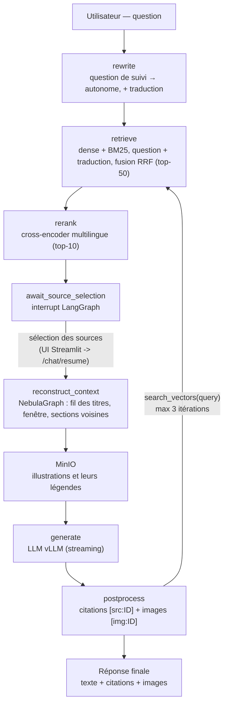

# RAG Agent Chat

Ce projet est l'agent conversationnel qui consomme les données produites par [rag-ingestion-pipeline](https://github.com/floSa/rag-ingestion-pipeline). Il interroge **ChromaDB** (recherche vectorielle), reconstruit le contexte structurel des documents via **NebulaGraph**, récupère les médias depuis **MinIO**, et génère les réponses avec un LLM local servi par **vLLM** — le tout orchestré par une machine à états **LangGraph** avec sélection des sources par l'utilisateur (*human-in-the-loop*).


> Contrairement au RAG classique qui injecte des chunks isolés, l'agent utilise le **graphe de connaissances pour reconstruire la section complète** autour de chaque passage trouvé : fil des titres jusqu'au document, éléments voisins, fin de la section précédente et début de la suivante, illustrations avec leur légende.

---

## Architecture & Technologies

- **Agent (LangGraph)** : machine à états `retrieve → rerank → sélection user → reconstruction graphe → génération → post-processing`, avec boucle agentique (le LLM peut relancer une recherche via `search_vectors(query)`, max 3 itérations).
- **Backend (FastAPI)** : expose le flux complet (`/chat/start` + `/chat/resume`), des endpoints unitaires (`/search`, `/sources`, `/context/{id}`, `/chat/simple`, `/answer`) et un `/reindex` que l'ingestion appelle en fin de pipeline, avec réponses en streaming SSE.
- **Frontend (Streamlit)** : UI de chat en 3 phases — question, sélection des sources (cases à cocher groupées par document), réponse avec citations et images.
- **Recherche** : hybride — dense (`paraphrase-multilingual-MiniLM-L12-v2`, le **même modèle** que l'ingestion, obligatoire) et lexicale BM25, sur la question **et sa traduction**, fusionnées par Reciprocal Rank Fusion. Reranking par cross-encoder multilingue `mmarco-mMiniLMv2-L12-H384-v1`, local.
- **Évaluation** : **deux** jeux de questions et aucun ne remplace l'autre — 138 questions générées depuis le corpus pour le *réglage* (`make eval`), 30 questions écrites à la main par le pipeline d'ingestion pour le *contrôle* (`make eval-controle`). Campagne déterministe sans juge LLM, et un antécédent obligatoire : `make verifier-les-ancrages` prouve que les jeux désignent des passages qui existent, en lecture seule, avant toute mesure. Plus un banc de réglage rapide pour les paramètres de recherche.
- **LLM** : **vLLM depuis le 17 septembre 2026** (conteneur `vllm-central`, réseau `llm-net`). Ce projet n'embarque aucun serveur d'inférence : il consomme un service central. **Un seul moteur est supporté depuis le lot 28** : le réglage qui en choisissait un parmi deux a été retiré, et le retour arrière passe désormais par l'image étiquetée d'avant la bascule — [moteur_llm.md](documentation/moteur_llm.md), [identite_du_code_servi.md](documentation/identite_du_code_servi.md).
- **Stores en lecture** : ChromaDB, NebulaGraph et MinIO du projet d'ingestion, joints via le réseau Docker externe `rag_network`.

### Schéma du flux agent


```mermaid
flowchart TD
    U["Utilisateur — question"] --> W["rewrite<br/>question de suivi → autonome, + traduction"]
    W --> R["retrieve<br/>dense + BM25, question + traduction, fusion RRF (top-50)"]
    R --> K["rerank<br/>cross-encoder multilingue (top-10)"]
    K --> S["await_source_selection<br/>interrupt LangGraph"]
    S -- "sélection des sources<br/>(UI Streamlit -> /chat/resume)" --> G["reconstruct_context<br/>NebulaGraph : fil des titres, fenêtre, sections voisines"]
    G --> M["MinIO<br/>illustrations et leurs légendes"]
    M --> L["generate<br/>LLM vLLM (streaming)"]
    L --> P["postprocess<br/>citations [src:ID] + images [img:ID]"]
    P -- "search_vectors(query)<br/>max 3 itérations" --> R
    P --> F["Réponse finale<br/>texte + citations + images"]
```

L'étape clé est la **reconstruction par le graphe** : pour chaque passage sélectionné, l'agent remonte les arêtes `PARENT_OF` jusqu'au `Document` en notant les titres traversés, puis récupère une fenêtre d'éléments autour du passage, la fin de la section précédente et le début de la suivante. Le LLM reçoit une section située dans son document au lieu d'un fragment isolé — et chaque élément porte son marqueur `[src:ID]`, ce qui permet de citer sans inventer.

---

## Quickstart

### 0. Prérequis

Deux stacks doivent tourner :

- [rag-ingestion-pipeline](https://github.com/floSa/rag-ingestion-pipeline) — crée le réseau `rag_network`, héberge ChromaDB, NebulaGraph et MinIO, et doit avoir ingéré au moins un document ;
- un serveur d'inférence sur le réseau `llm-net` : **`vllm-central`** (servi depuis le 17 septembre 2026), monté par le projet [llm-service](https://github.com/floSa/llm-service).

### 1. Configurer l'environnement
```bash
# Copier le gabarit et remplir les valeurs manquantes
cp .env.example .env
# MINIO_ROOT_PASSWORD : même valeur que dans le .env du projet d'ingestion
```

### 2. Démarrer les services
```bash
# Construire et lancer la stack (make up = docker compose up -d)
docker compose up -d --build
```


### 3. Accéder aux interfaces
| Service | URL | Note |
| :--- | :--- | :--- |
| **Frontend (Streamlit)** | [http://localhost:8506](http://localhost:8506) | Interface de chat avec sélection des sources. |
| **API (FastAPI)** | [http://localhost:8011/docs](http://localhost:8011/docs) | Swagger UI — tous les endpoints. |
| **vLLM** | `http://vllm-central:8000` | Moteur servi depuis le 17 septembre 2026, sur le réseau `llm-net`. |

### 4. Poser une question
1. Ouvrez le frontend Streamlit et saisissez votre question.
2. L'agent affiche les sources trouvées, **groupées par document** avec extraits et scores — décochez celles qui ne sont pas pertinentes.
3. Validez : l'agent reconstruit le contexte via le graphe et génère la réponse en streaming, avec **citations** `[src:ID]` et **images** récupérées depuis MinIO.

---

## Où accéder au service

**Ce projet est un déploiement local. Il n'est pas hébergé et n'a pas d'URL publique.**

Une fois la pile démarrée, sur la machine qui l'héberge :

| | Adresse par défaut |
|---|---|
| Interface (Streamlit) | `http://<hôte>:8506` |
| API | `http://<hôte>:8011` |
| Sonde de santé, sans secret | `http://<hôte>:8011/health` |

Depuis une autre machine du même réseau, remplacer `<hôte>` par l'adresse de la
machine hôte. **Avant d'ouvrir l'accès au-delà du réseau de confiance**, poser
`API_KEY` dans le `.env` : laissée vide, toutes les routes répondent sans
authentification — **y compris `POST /reindex`, qui reconstruit l'index**. Seule
`/health` reste volontairement ouverte, pour qu'une sonde n'ait pas besoin d'un
secret.

## API — Endpoints principaux

| Méthode | Route | Rôle |
| :--- | :--- | :--- |
| `GET` | `/health` | Statut du service, modèle **demandé**, et — sous `moteur_llm` — le moteur **réellement servi** : serveur, version, poids et son empreinte. Le premier est un réglage, le second un fait, et ils ont divergé — [moteur_llm.md](documentation/moteur_llm.md). Publie aussi — sous `code_servi` — **quel code cette image contient** : le sha relevé au build, ou `anonyme` quand l'image a été construite hors de `make image` — [identite_du_code_servi.md](documentation/identite_du_code_servi.md). |
| `POST` | `/search` | Retrieval brut ChromaDB, sans reranking. |
| `POST` | `/sources` | Retrieval + reranking + groupement par document. |
| `GET` | `/context/{element_id}` | Reconstruction du contexte enrichi d'un élément. |
| `POST` | `/answer` | Question → réponse, sans sélection humaine. Retourne aussi les sections reconstruites — en distinguant celles qui sont réellement parties au LLM de celles que le budget a écartées —, la partition du temps par étage et les décomptes de tokens du serveur : c'est le point d'entrée évaluable. |
| `POST` | `/chat/start` | Démarre le flux LangGraph, suspend en attente de sélection. |
| `POST` | `/chat/resume` | Reprend après sélection des sources (réponse en SSE). |
| `POST` | `/chat/simple` | Génération directe sans boucle agentique. |
| `POST` | `/feedback` | Appréciation binaire d'une réponse (`utile` / `inutile`) et commentaire libre, rattachés au `thread_id`. |
| `POST` | `/reindex` | Reconstruit l'index lexical BM25 sur le corpus courant. **À appeler par le pipeline d'ingestion en fin de traitement** : sans lui, un document ingéré après le démarrage de l'agent reste invisible en recherche lexicale (cf. [stores.md](documentation/stores.md)). |
| `GET` | `/media/{object_name}` | Proxy des images MinIO (le réseau Docker interne n'est pas visible du navigateur). |

---

## Configuration (`.env`)

Les variables clés (voir `.env.example` pour la liste complète) :

| Variable | Défaut | Note |
| :--- | :--- | :--- |
| `LLM_HOST` | `http://vllm-central:8000` | Le serveur qui génère. **Remplace deux couples de réglages et un interrupteur, retirés au lot 28** — un `.env` antérieur doit être migré, la marche à suivre est dans [moteur_llm.md](documentation/moteur_llm.md). |
| `LLM_MODEL` | `google/gemma-4-E4B-it-qat-w4a16-ct` | Le modèle demandé, tel que le serveur le sert. `/health` le confronte au catalogue et publie `modele_servi: null` s'il ne le reconnaît pas. |
| `LLM_NUM_CTX` | `8192` | Le budget de prompt que le **client** s'autorise. Il n'est pas envoyé au serveur — le dialecte OpenAI n'a pas ce champ, et la fenêtre servie (32768) est fixée au lancement. Le budget de sources en dérive (cf. [llm.md](documentation/llm.md)). |
| `LLM_MAX_TOKENS` | `4096` | Plafond de génération. Réserve la moitié de la fenêtre : **à mesurer**, cf. [llm.md](documentation/llm.md). |
| `LLM_THINKING` | `false` | Raisonnement de Gemma 4 — rédhibitoire en CPU. |
| `HISTORY_WINDOW_SHARE` | `0.25` | Part de la fenêtre de prompt laissée à l'historique, le reste allant aux sources. Forfait, cf. [llm.md](documentation/llm.md). |
| `TRUNCATION_FLOOR_SHARE` | `1/3` | Part de sa source qu'un fragment tronqué doit atteindre pour être retenu. Forfait : aucune mesure ne désigne cette valeur, son prix est continu — cf. [llm.md](documentation/llm.md). |
| `TORCH_DEVICE` | `cuda` | Périphérique de l'embedder et du cross-encoder. **`cuda` depuis le 11 septembre 2026, sur mesure** : `rerank_ms` p50 498 → 58 ms, `total_ms` p50 7 298 → 6 481 ms (−11,2 %), et la contention avec le serveur LLM sur la même carte chiffrée à **+40 ms** contre 817 gagnés — [campagne](documentation/campagnes/2026-09-11-le-gpu-sur-les-etages-torch.md). Trois conditions indépendantes décident qu'un calcul part vraiment sur la carte — le build de l'image, la réservation au conteneur, ce réglage — et chacune suffit à tout ramener sur le CPU **sans rien dire** ; `/health` publie les trois sous `torch_device`. `cpu` y ramène le service sans reconstruire — [gpu_cuda.md](documentation/gpu_cuda.md). |
| `EMBEDDING_MODEL_NAME` | `paraphrase-multilingual-MiniLM-L12-v2` | **DOIT** correspondre au modèle qui a indexé la collection. Depuis le 4 septembre 2026 l'agent le vérifie contre l'estampille `embedding_model` de la collection et **refuse de chercher** sinon — `503`, `/health` en `degraded`. Une estampille **absente** est refusée aussi. |
| `RERANK_MODEL` | `cross-encoder/mmarco-mMiniLMv2-L12-H384-v1` | Multilingue : un reranker anglais défait le travail de l'embedder. |
| `RETRIEVAL_TOP_K` / `RERANK_TOP_K` | `50` / `10` | Vivier large, puis coupe. Le balayage qui a retenu 50 vit à son **site canonique**, le commentaire de `retrieval_top_k` dans [settings.py](src/agent/settings.py) — recopié ici, il en ferait un second site. **Et il est antérieur au corpus en service :** `mesuré` le **3 août 2026** (`git log -S` sur ce chiffre), soit un mois avant le remplacement du corpus du 2 septembre 2026. Il a décidé d'un réglage et n'a pas été rejoué depuis ; le rappel du corpus actuel est celui de la [campagne de référence](documentation/campagnes/2026-09-08-campagne-de-reference.md). |
| `HYBRID_SEARCH` / `FETCH_K` / `RRF_K` | `true` / `50` / `60` | BM25 en plus du dense, fusionné par rangs. |
| `CROSS_LINGUAL_SEARCH` / `TRANSLATION_WEIGHT` | `true` / `1.0` | Cherche aussi dans la traduction de la question. Mesuré : rappel translinguistique 0,806 → 1,000 — **même réserve que la ligne précédente**, ce chiffre est du 3 août 2026 et n'a pas été rejoué sur le corpus en service. |
| `QUERY_REWRITE` | `true` | Rend une question de suivi autonome avant de l'encoder. |
| `CONTEXT_WINDOW_BEFORE/AFTER` | `6` | Éléments retenus autour du passage trouvé. |
| `ADJACENT_SECTION_ELEMENTS` | `3` | Éléments repris des sections voisines (0 désactive). |
| `API_KEY` / `CORS_ORIGINS` | vide / `localhost` | Vide = pas d'authentification, acceptable en local seulement. |
| `CHECKPOINT_DB_PATH` | `/app/data/checkpoints.sqlite` | Sessions LangGraph **et** registre de leur purge, dans le même fichier. Vide = checkpointer en mémoire : les sessions ne survivent pas au redémarrage. |
| `SESSION_TTL_SECONDS` / `MAX_LIVE_SESSIONS` | `3600` / `200` | Bornes de la purge des sessions, en âge et en nombre. La purge est **durable** : elle atteint une session antérieure à un redémarrage, et `/health` publie sous `sessions` ce qu'elle a réellement supprimé. |
| `USAGE_CAPTURE` / `USAGE_DB_PATH` | `true` / `/app/data/usage.sqlite` | Enregistre questions, sources proposées, décochages et réponses. **Actif par défaut**, aucune purge, rien ne sort du disque local — cf. [capture_usage.md](documentation/capture_usage.md). |
| `MINIO_ROOT_PASSWORD` | — | Même valeur que le projet d'ingestion. |

---

## Développement

```bash
make lint              # ruff check
make format            # ruff format + fix
make typecheck         # mypy
make test              # tests unitaires (pytest)
make test-integration  # tests d'intégration (stores requis)
make verifier-les-ancrages  # l'ANTECEDENT : les jeux designent-ils des passages qui existent ?
make eval                   # reglage — 138 questions, comparee APPARIEE a la reference
make eval-controle          # controle — les 30 questions du pipeline d'ingestion
make models            # modèles servis par llm-service
make health            # état de l'API et de ses dépendances
make audit             # pip-audit sur requirements.txt
bash scripts/e2e_smoke.sh   # test de fumée bout en bout (stack démarrée + document ingéré)
```

---

## Structure du Projet

```text
rag-agent-chat/
├── documentation/              # Doc technique (architecture, stores, évaluation, sécurité)
│   └── llm_integration_plan.md # Contrat d'interface avec rag-ingestion-pipeline
├── prompts/                    # Prompts versionnés (system.txt, templates Jinja2)
├── scripts/
├── src/
│   ├── agent/                  # Cœur de l'agent
│   │   ├── graph.py            # Machine à états LangGraph
│   │   ├── state.py            # AgentState
│   │   ├── retriever.py        # ChromaDB + reranking cross-encoder
│   │   ├── graph_context.py    # Reconstruction de section via NebulaGraph
│   │   ├── minio_client.py     # URLs présignées des images
│   │   ├── sessions.py         # Registre durable des sessions et purge du checkpointer
│   │   ├── llm.py              # Client LLM (génération streaming, deux dialectes)
│   │   └── settings.py         # Configuration pydantic-settings
│   ├── api/                    # Backend FastAPI (main.py, schemas.py)
│   └── frontend/               # UI Streamlit (app.py)
├── tests/                      # Tests unitaires et d'intégration
├── docker-compose.yml          # agent-api + frontend (LLM : llm-service)
├── Dockerfile.agent            # Environnement backend
└── Dockerfile.frontend         # Environnement Streamlit
```

---

## Lien avec rag-ingestion-pipeline

| Store | Accès | Usage par l'agent |
| :--- | :--- | :--- |
| **ChromaDB** | `chromadb:8000` (collection `rag_documents`) | Recherche vectorielle des chunks (384 dim). |
| **NebulaGraph** | `graphd:9669` (space `rag_space`) | Remontée `PARENT_OF` → breadcrumb + reconstruction de section. |
| **MinIO** | `minio:9000` (bucket `documents`) | Images et tableaux croppés, servis en URLs présignées. |

L'agent est **en lecture seule** sur ces stores. Le contrat — métadonnées ChromaDB, schéma du graphe, format des VID, et ce qui casse quand il n'est pas tenu — est documenté dans [documentation/stores.md](documentation/stores.md).

## Documentation

| Fichier | Contenu |
| :--- | :--- |
| [architecture.md](documentation/architecture.md) | Le système tel qu'il est : services, machine à états, décisions |
| [agent_architecture.md](documentation/agent_architecture.md) | Vue détaillée de l'agent : nœuds, données, prompts, réglages |
| [stores.md](documentation/stores.md) | Le contrat avec l'ingestion, du point de vue du consommateur |
| [pour_le_pipeline_ingestion.md](documentation/pour_le_pipeline_ingestion.md) | Ce que l'agent attend du pipeline d'ingestion, et ce qui casse en silence sinon |
| [llm.md](documentation/llm.md) | Le service d'inférence central et la fenêtre de contexte |
| [rag_evaluation_strategy.md](documentation/rag_evaluation_strategy.md) | Comment le système est mesuré, et ce que la mesure a tranché |
| [capture_usage.md](documentation/capture_usage.md) | Ce que le service enregistre de son usage, et les requêtes qui l'exploitent |
| [tests.md](documentation/tests.md) | Les trois niveaux de test, et ce que rien ne couvre |
| [moteur_llm.md](documentation/moteur_llm.md) | Quel moteur LLM a généré une campagne, et pourquoi le seul nom de modèle demandé ne suffisait pas : il est mutable, et deux campagnes séparées par une bascule de moteur se comparaient sans que rien ne le dise. **Porte aussi la migration du `.env` du lot 28.** |
| [identite_du_code_servi.md](documentation/identite_du_code_servi.md) | Quel code tourne, et comment revenir en arrière : l'image porte son sha, `/health` le publie ou déclare l'image **anonyme**, et l'étiquette de retour se vérifie AVANT de construire — douze lots ont exécuté du code antérieur sans que rien ne le dise |
| [gpu_cuda.md](documentation/gpu_cuda.md) | Installer et activer CUDA : les trois conditions, comment vérifier chacune, ce que ça coûte, et le retour en arrière |
| [axes_amelioration.md](documentation/axes_amelioration.md) | Ce qui est corrigé, ce qui reste ouvert |
| [SECURITY.md](documentation/SECURITY.md) | Surface exposée, défenses, et ce qui n'est pas protégé |
| [llm_integration_plan.md](documentation/llm_integration_plan.md) | Plan de conception initial — historique |

---

## Licences & composants

| Composant | Rôle | Licence |
|---|---|---|
| vLLM | Serveur d'inférence | Apache-2.0 |
| FastAPI / Uvicorn | API / serveur ASGI | MIT / BSD-3-Clause |
| Streamlit | Frontend | Apache-2.0 |
| LangGraph / langchain-core | Boucle agentique | MIT |
| ChromaDB | Base vectorielle | Apache-2.0 |
| sentence-transformers | Embeddings / reranking | Apache-2.0 |
| Nebula Graph (nebula3-python) | Graphe de connaissances | Apache-2.0 |
| MinIO | Stockage d'objets | AGPL-3.0 |
| Jinja2 | Templating | BSD-3-Clause |
| Pydantic | Config & typage | MIT |
| **Ce projet** | Code applicatif | MIT — Copyright (c) 2026 floSa `<à confirmer : aucun fichier LICENSE présent>` |
